# ER図（エンティティ関連図）

## 図

```mermaid
erDiagram

    BOARD {
        string id PK "ボードID（一意の識別子）"
        string title "ボードのタイトル（例：TaskBoard）"
        string createdAt "作成日時"
    }

    LIST {
        string id PK "リストID（一意の識別子）"
        string boardId FK "所属するボードのID"
        string title "リストのタイトル（例：やること・進行中・完了）"
        int position "表示順（左から何番目か）"
        string createdAt "作成日時"
        string updatedAt "最終更新日時（リスト名を変更したとき）"
    }

    CARD {
        string id PK "カードID（一意の識別子）"
        string listId FK "所属するリストのID（移動すると変わる）"
        string title "カードのタイトル（タスク名）"
        string memo "メモ（自由記述・任意）"
        string dueDate "期日（例：2026-05-10・任意）"
        int position "表示順（上から何番目か）"
        string createdAt "作成日時"
        string updatedAt "最終更新日時（保存ボタンを押したとき）"
    }

    BOARD ||--o{ LIST : "1つのボードは複数のリストを持つ"
    LIST  ||--o{ CARD : "1つのリストは複数のカードを持つ"
```



---

## 用語の説明

| 用語 | 説明 |
|------|------|
| **PK**（Primary Key） | そのデータを一意に識別するID。他と絶対に重複しない |
| **FK**（Foreign Key） | 別のテーブルのIDを参照する項目。どこに所属するかを表す |
| **\|\|--o{** | 「1対多」の関係を表す記号。1つのボードに複数のリストが属する |
| **updatedAt** | データが最後に変更された日時。保存・編集・移動のたびに自動で記録される |

---

## 関係の説明

```
BOARD（ボード）
  └── LIST（リスト）　※ 1つのボードに複数のリストが属する
        └── CARD（カード）　※ 1つのリストに複数のカードが属する
```

- **BOARD → LIST**：1つのボードは0個以上のリストを持てる
- **LIST → CARD**：1つのリストは0個以上のカードを持てる
- カードは必ずどこか1つのリストに所属する
- リストは必ずどこか1つのボードに所属する

---

## 画面とデータの対応

要件定義書の画面設計・データの流れと、このER図の対応関係を示します。

| 画面の操作 | 変化するデータ |
|------------|----------------|
| ＋リストを追加 | `LIST` にレコードが1件追加される |
| リスト名を編集（✏️） | `LIST.title` と `LIST.updatedAt` が更新される |
| リストを削除（🗑️） | `LIST` のレコードと、そのリストに属する `CARD` が削除される |
| ＋カードを追加 | `CARD` にレコードが1件追加される |
| カードを詳細画面で保存（💾） | `CARD.title`・`CARD.memo`・`CARD.dueDate`・`CARD.updatedAt` が更新される |
| カードをドラッグ&ドロップで移動 | `CARD.listId`・`CARD.position`・`CARD.updatedAt` が更新される |
| カードを削除（🗑️） | `CARD` のレコードが削除される |

---

## データの保存場所

要件定義書 第5章に記載のとおり、すべてのデータは **ブラウザの保存領域（localStorage）** に保存されます。

```
localStorage（パソコン内ブラウザ）
  └── "taskboard-data"（キー名）
        └── JSON形式で以下を保存
              ├── BOARD（ボード情報）
              ├── LIST（リスト一覧）
              └── CARD（カード一覧）
```
