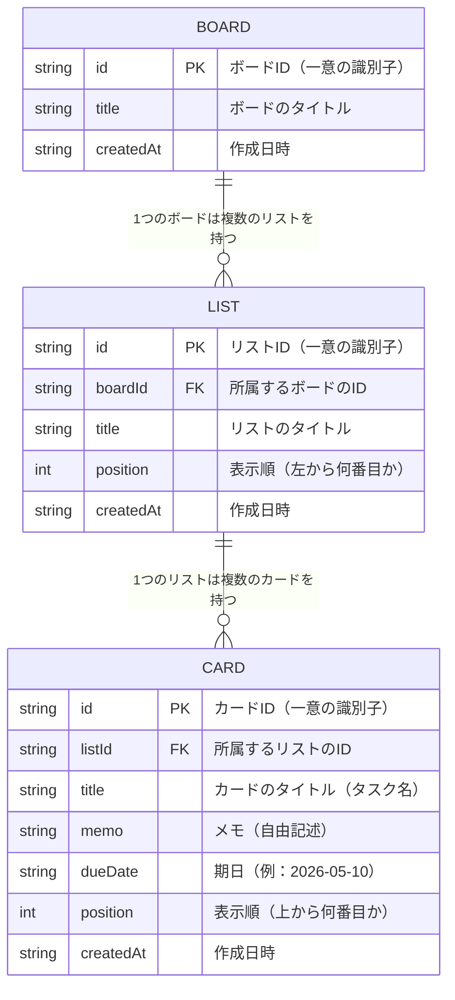

# ER図（エンティティ関連図）

## 図



---

## 用語の説明

| 用語 | 説明 |
|------|------|
| **PK**（Primary Key） | そのデータを一意に識別するID。他と絶対に重複しない |
| **FK**（Foreign Key） | 別のテーブルのIDを参照する項目。どこに所属するかを表す |
| **\|\|--o{** | 「1対多」の関係を表す記号。1つのボードに複数のリストが属する |

---

## 関係の説明

```
BOARD（ボード）
  └── LIST（リスト）　※ 1つのボードに複数のリストが属する
        └── CARD（カード）　※ 1つのリストに複数のカードが属する
```

- **BOARD → LIST**：1つのボードは0個以上のリストを持てる
- **LIST → CARD**：1つのリストは0個以上のカードを持てる
- カードは必ずどこか1つのリストに所属する
- リストは必ずどこか1つのボードに所属する
