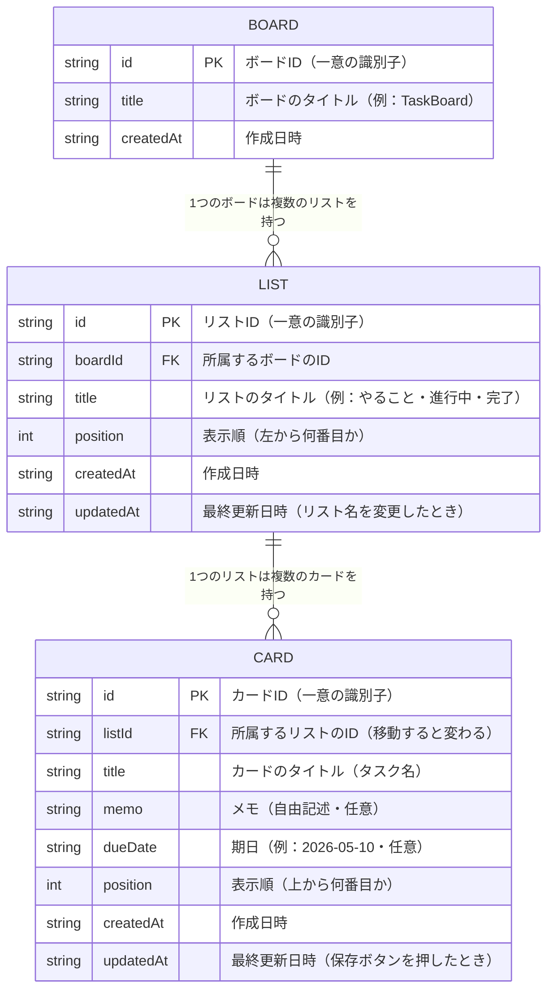
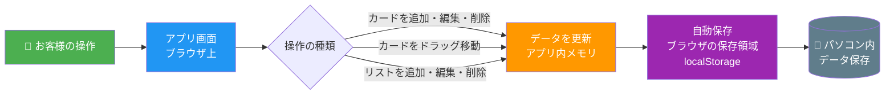
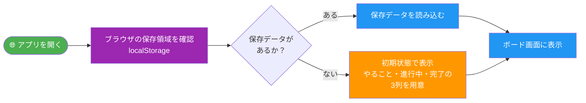

# タスク管理アプリ データ設計書

| 項目 | 内容 |
|------|------|
| 文書番号 | DAT-001 |
| 版番号 | 第1版 |
| 作成日 | 2026年5月8日 |
| 作成者 | Katsuro Hatano |
| 関連文書 | [要件定義書_開発者向け](要件定義書_開発者向け.md) / [画面設計書](画面設計書.md) |

---

## 1. ER図（エンティティ関連図）

データの構造と、各データの関係を表した図です。



### 用語の説明

| 用語 | 説明 |
|------|------|
| **PK**（Primary Key） | そのデータを一意に識別するID。他と絶対に重複しない |
| **FK**（Foreign Key） | 別のテーブルのIDを参照する項目。どこに所属するかを表す |
| **\|\|--o{** | 「1対多」の関係を表す記号。1つのボードに複数のリストが属する |
| **updatedAt** | データが最後に変更された日時。保存・編集・移動のたびに自動で記録される |

### 関係の説明

```
BOARD（ボード）
  └── LIST（リスト）　※ 1つのボードに複数のリストが属する
        └── CARD（カード）　※ 1つのリストに複数のカードが属する
```

- **BOARD → LIST**：1つのボードは0個以上のリストを持てる
- **LIST → CARD**：1つのリストは0個以上のカードを持てる
- カードは必ずどこか1つのリストに所属する
- リストは必ずどこか1つのボードに所属する

---

## 2. 画面操作とデータの対応

画面上の操作によって、どのデータが変化するかを示します。

| 画面の操作 | 変化するデータ |
|------------|----------------|
| ＋リストを追加 | `LIST` にレコードが1件追加される |
| リスト名を編集（✏️） | `LIST.title` と `LIST.updatedAt` が更新される |
| リストを削除（🗑️） | `LIST` のレコードと、そのリストに属する `CARD` が削除される |
| ＋カードを追加 | `CARD` にレコードが1件追加される |
| カードを詳細画面で保存（💾） | `CARD.title`・`CARD.memo`・`CARD.dueDate`・`CARD.updatedAt` が更新される |
| カードをドラッグ&ドロップで移動 | `CARD.listId`・`CARD.position`・`CARD.updatedAt` が更新される |
| カードを削除（🗑️） | `CARD` のレコードが削除される |

---

## 3. データの流れ

### 3-1. データ保存の流れ



### 3-2. データ読み込みの流れ



---

## 4. データの保存場所

### 4-1. 保存構造

```
パソコン
└── Google Chrome（ブラウザ）
    └── ブラウザの保存領域（localStorage）
        └── TaskBoard のデータ
            ├── リスト一覧（列の名前・並び順）
            └── カード一覧（タスク名・メモ・期日・所属リスト）
```

### 4-2. localStorageのキー設計

| キー | 内容 | 型 |
|------|------|----|
| `taskboard_data` | ボード全体のデータ | `Board`（JSON文字列） |

### 4-3. 保存イメージ（JSON）

```
localStorage（パソコン内ブラウザ）
  └── "taskboard_data"（キー名）
        └── JSON形式で以下を保存
              ├── BOARD（ボード情報）
              ├── LIST（リスト一覧）
              └── CARD（カード一覧）
```

> **ご注意：** データはお客様のパソコン内にのみ保存されます。  
> インターネット上には送信されませんので、プライバシーの観点から安心してご利用いただけます。  
> ただし、ブラウザの「閲覧データを消去」を行うと、保存されたタスクが削除されます。
