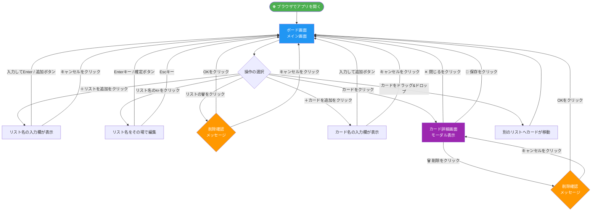

# タスク管理アプリ 画面遷移図

| 項目 | 内容 |
|------|------|
| 文書番号 | UI-002 |
| 版番号 | 第1版 |
| 作成日 | 2026年5月8日 |
| 作成者 | Katsuro Hatano |
| 関連文書 | [画面設計書](画面設計書.md) / [要件定義書_お客様向け](要件定義書_お客様向け.md) |

---

## 1. 画面遷移図

アプリを使うときの画面の移り変わりを図で示します。

---

## 2. 遷移の説明

| 操作 | 結果 |
|------|------|
| アプリを開く | ボード画面が表示されます |
| ＋リストを追加 | 入力欄が表示され、名前を入力後にボード画面へ戻ります |
| リスト名を編集 | その場で入力欄が開き、確定後にボード画面へ戻ります |
| リストを削除 | 確認ダイアログが表示され、OKでボード画面へ戻ります |
| ＋カードを追加 | 入力欄が表示され、追加後にボード画面へ戻ります |
| カードをクリック | カード詳細画面（モーダル）が開きます |
| 保存／閉じるをクリック | モーダルが閉じ、ボード画面へ戻ります |
| ドラッグ&ドロップ | カードが別のリストへ移動し、ボード画面がそのまま更新されます |
