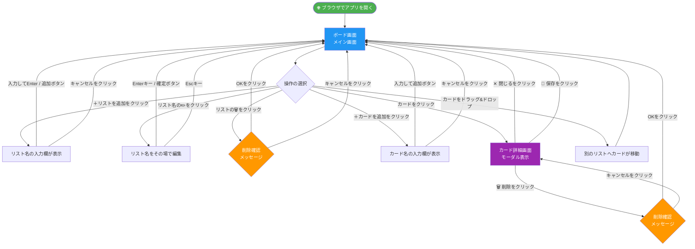
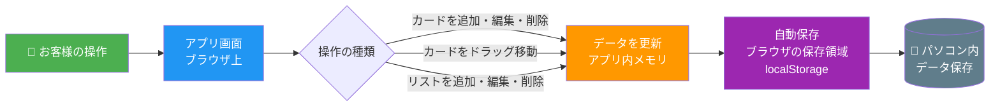
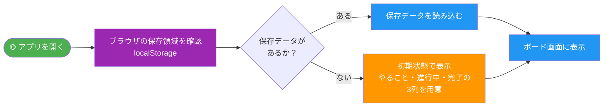

# タスク管理アプリ 要件定義書

| 項目 | 内容 |
|------|------|
| 文書番号 | REQ-001 |
| 版番号 | 第2版 |
| 作成日 | 2026年4月30日 |
| 最終更新日 | 2026年5月7日 |
| 作成者 | Katsuro Hatano |
| ステータス | 確認待ち |

---

## 改訂履歴

| 版 | 改訂日 | 改訂内容 | 担当者 |
|----|--------|----------|--------|
| 第1版 | 2026年4月30日 | 初版作成 | Katsuro Hatano |
| 第2版 | 2026年5月7日 | 画面設計・画面遷移・データの流れを追加 | Katsuro Hatano |

---

## 1. はじめに

### 1-1. 本書の目的

本書は、タスク管理アプリの開発にあたり、お客様とのご認識を合わせるために作成した資料です。  
開発を始める前に内容をご確認いただき、ご合意をお願いいたします。

### 1-2. プロジェクト概要

| 項目 | 内容 |
|------|------|
| アプリ名 | TaskBoard（タスクボード） |
| 目的 | 個人のタスクをボード形式で視覚的に管理する |
| 利用者 | ご本人のみ（1名） |
| 利用環境 | パソコンのウェブブラウザ（Google Chrome推奨） |

---

## 2. 用語の説明

本書で使用する言葉を以下のとおり定義します。

| 用語 | 説明 |
|------|------|
| **ボード** | アプリ全体の作業スペース。タスクをまとめて管理する画面のこと |
| **リスト** | ボード上に並ぶ列のこと。例：「やること」「進行中」「完了」 |
| **カード** | 個々のタスク（作業）を表すメモ。リストの中に入っている |
| **ドラッグ&ドロップ** | マウスでつかんで移動させる操作のこと |
| **ブラウザ保存** | データをインターネット上ではなく、お使いのパソコン内に保存する方法 |
| **モーダル** | 現在の画面の上に重ねて表示される小さなウィンドウのこと |

---

## 3. 画面設計

### 3-1. 画面一覧

本アプリで使用する画面は以下の2種類です。

| 画面名 | 説明 |
|--------|------|
| **ボード画面（メイン画面）** | アプリを開いたときに最初に表示される画面。リストとカードを管理する |
| **カード詳細画面（モーダル）** | カードをクリックすると表示される詳細入力ウィンドウ |

---

### 3-2. ボード画面（メイン画面）

アプリを開くと最初に表示される画面です。

```
┌──────────────────────────────────────────────────────────────────┐
│  📋 TaskBoard                                                      │
├──────────────────────────────────────────────────────────────────┤
│                                                                    │
│  ┌─────────────────┐  ┌─────────────────┐  ┌─────────────────┐   │
│  │  やること   ✏️ 🗑️ │  │  進行中     ✏️ 🗑️ │  │  完了       ✏️ 🗑️ │   │
│  │─────────────────│  │─────────────────│  │─────────────────│   │
│  │                 │  │                 │  │                 │   │
│  │ ┌─────────────┐ │  │ ┌─────────────┐ │  │ ┌─────────────┐ │   │
│  │ │ 企画書作成  │ │  │ │ デザイン確認│ │  │ │ 会議の準備  │ │   │
│  │ │ 📅 5/10 🔴  │ │  │ │ 📅 5/8  🟡  │ │  │ ✅ 完了済み  │ │   │
│  │ └─────────────┘ │  │ └─────────────┘ │  │ └─────────────┘ │   │
│  │                 │  │                 │  │                 │   │
│  │ ┌─────────────┐ │  │                 │  │                 │   │
│  │ │ 資料収集    │ │  │                 │  │                 │   │
│  │ │ 📅 期日なし │ │  │                 │  │                 │   │
│  │ └─────────────┘ │  │                 │  │                 │   │
│  │                 │  │                 │  │                 │   │
│  │  ＋ カードを追加│  │  ＋ カードを追加│  │  ＋ カードを追加│   │
│  └─────────────────┘  └─────────────────┘  └─────────────────┘   │
│                                                                    │
│  ＋ リストを追加                                                    │
└──────────────────────────────────────────────────────────────────┘
```

**各部品の説明**

| 部品 | 説明 |
|------|------|
| ✏️（リスト名横） | クリックするとリスト名を変更できます |
| 🗑️（リスト名横） | クリックするとリストを削除できます |
| 🔴（カード内） | 期日が過ぎているカードに表示される赤いマーク |
| 🟡（カード内） | 期日が今日のカードに表示される黄色いマーク |
| ＋ カードを追加 | 各リストの一番下にあります。クリックすると新しいカードを追加します |
| ＋ リストを追加 | 画面の左下にあります。クリックすると新しい列を追加します |

---

### 3-3. リスト名の入力欄（インライン編集）

リスト名の✏️をクリックすると、その場で直接編集できます。

```
┌─────────────────────────────┐
│ ┌─────────────────────────┐ │
│ │ やること          [確定]│ │  ← 直接文字を入力できます
│ └─────────────────────────┘ │
│  ※ Enterキーでも確定できます │
└─────────────────────────────┘
```

---

### 3-4. カード追加の入力欄

「＋ カードを追加」をクリックすると、その場に入力欄が現れます。

```
┌─────────────────┐
│  やること        │
│─────────────────│
│ ┌─────────────┐ │
│ │企画書作成   │ │
│ └─────────────┘ │
│                 │
│ ┌─────────────┐ │
│ │             │ │  ← タスク名を入力します
│ └─────────────┘ │
│ [追加] [キャンセル]│
└─────────────────┘
```

---

### 3-5. カード詳細画面（モーダル）

カードをクリックすると、画面の中央にこのウィンドウが表示されます。

```
┌──────────────────────────────────────┐
│  企画書作成                   ［✕ 閉じる］│
├──────────────────────────────────────┤
│                                      │
│  タスク名                            │
│  ┌────────────────────────────────┐  │
│  │ 企画書作成                     │  │
│  └────────────────────────────────┘  │
│                                      │
│  メモ（自由に入力できます）           │
│  ┌────────────────────────────────┐  │
│  │                                │  │
│  │ 〇〇さんに確認が必要           │  │
│  │                                │  │
│  └────────────────────────────────┘  │
│                                      │
│  期日（任意）                        │
│  ┌────────────────────────────────┐  │
│  │ 📅 2026年5月10日               │  │
│  └────────────────────────────────┘  │
│                                      │
│              ［💾 保存］  ［🗑️ 削除］   │
└──────────────────────────────────────┘
```

**各ボタンの説明**

| ボタン | 説明 |
|--------|------|
| ✕ 閉じる | 変更を保存せずにウィンドウを閉じます |
| 💾 保存 | 入力した内容を保存してウィンドウを閉じます |
| 🗑️ 削除 | このカードを削除します（確認メッセージが表示されます） |

---

## 4. 画面遷移の流れ

アプリを使うときの画面の移り変わりを図で示します。



**遷移の説明**

| 操作 | 結果 |
|------|------|
| アプリを開く | ボード画面が表示されます |
| ＋リストを追加 | 入力欄が表示され、名前を入力後にボード画面へ戻ります |
| リスト名を編集 | その場で入力欄が開き、確定後にボード画面へ戻ります |
| リストを削除 | 確認ダイアログが表示され、OKでボード画面へ戻ります |
| ＋カードを追加 | 入力欄が表示され、追加後にボード画面へ戻ります |
| カードをクリック | カード詳細画面（モーダル）が開きます |
| 保存／閉じるをクリック | モーダルが閉じ、ボード画面へ戻ります |
| ドラッグ&ドロップ | カードが別のリストへ移動し、ボード画面がそのまま更新されます |

---

## 5. データの流れ

お客様の操作からデータの保存・読み込みまでの流れを示します。

### 5-1. データ保存の流れ



### 5-2. データ読み込みの流れ



### 5-3. データの保存場所

```
パソコン
└── Google Chrome（ブラウザ）
    └── ブラウザの保存領域（localStorage）
        └── TaskBoard のデータ
            ├── リスト一覧（列の名前・並び順）
            └── カード一覧（タスク名・メモ・期日・所属リスト）
```

> **ご注意：** データはお客様のパソコン内にのみ保存されます。  
> インターネット上には送信されませんので、プライバシーの観点から安心してご利用いただけます。  
> ただし、ブラウザの「閲覧データを消去」を行うと、保存されたタスクが削除されます。

---

## 6. 主な機能

### 6-1. リストの管理

| 機能 | 説明 |
|------|------|
| リストの追加 | 「＋リストを追加」をクリックすると新しい列を作れます |
| リスト名の変更 | リスト名横の✏️をクリックすると編集できます |
| リストの削除 | リスト名横の🗑️をクリックすると削除できます（確認メッセージが表示されます） |
| 初期リスト | 最初から「やること」「進行中」「完了」の3列が用意されています |

### 6-2. カードの管理

| 機能 | 説明 |
|------|------|
| カードの追加 | 「＋ カードを追加」をクリックするとタスクを追加できます |
| カードの移動 | カードをマウスでつかんで別のリストへ移動できます |
| カードの編集 | カードをクリックするとメモや期日を入力できます |
| カードの削除 | カード詳細画面の削除ボタンから削除できます |
| 期日の色分け | 期日が過ぎたカードは🔴赤色、当日のカードは🟡黄色で表示されます |

### 6-3. データの保存

| 機能 | 説明 |
|------|------|
| 自動保存 | 操作するたびに自動でデータが保存されます |
| 永続保存 | ブラウザを閉じてもデータは消えません |

---

## 7. 動作環境・前提条件

| 項目 | 内容 |
|------|------|
| 対応ブラウザ | Google Chrome（最新版） |
| 対応端末 | パソコン（Windows） |
| インターネット | 不要（オフラインで動作します） |
| データ保存場所 | お使いのパソコン内（ブラウザのデータ領域） |

> **注意：** ブラウザの「閲覧データを消去」を行うと、保存されたタスクが削除される場合があります。

---

## 8. 対象外（今回の開発に含まないもの）

以下の機能は今回の開発には含まれません。  
将来的な追加については、別途ご相談ください。

- 複数のパソコン間でのデータ共有
- スマートフォン・タブレット対応
- ファイルの添付
- メール・通知機能
- データのバックアップ・書き出し

---

## 9. 開発スケジュール（予定）

| ステップ | 内容 | 目安 |
|----------|------|------|
| ステップ1 | プロジェクト基盤の構築 | 第1週 |
| ステップ2 | 画面の骨格作成 | 第1週 |
| ステップ3 | カード・リストの追加／削除／編集 | 第2週 |
| ステップ4 | ドラッグ&ドロップ機能 | 第2週 |
| ステップ5 | データの永続保存 | 第3週 |
| ステップ6 | カード詳細（メモ・期日） | 第3週 |
| ステップ7 | デザイン仕上げ・動作確認 | 第4週 |

---

## 10. 受け入れ条件（完成の基準）

以下の条件をすべて満たした時点で、開発完了とします。

- [ ] カードをリストに追加できる
- [ ] カードをドラッグ&ドロップで別のリストへ移動できる
- [ ] カードにメモと期日を設定できる
- [ ] ブラウザを閉じて再度開いてもデータが残っている
- [ ] リストを追加・削除できる
- [ ] 期日を過ぎたカードが赤色で表示される

---

## 11. ご確認・ご合意

本書の内容をご確認いただき、問題がなければ下記にご署名をお願いいたします。

| 項目 | お客様 | 担当者 |
|------|--------|--------|
| 氏名 | | Katsuro Hatano |
| 確認日 | | 2026年5月7日 |
| 署名 | | |

> ご不明な点やご変更のご要望がございましたら、お気軽にお申し付けください。

---

*本書に関するお問い合わせ：hkjx3k@gmail.com*
